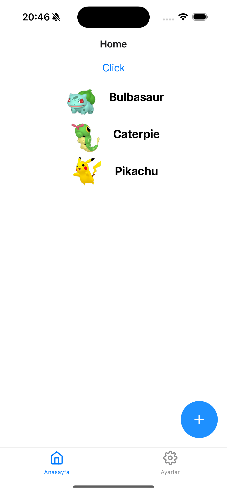

# React Native and Swift

This repository has been created to compare the differences between an application with same features developed in React Native and Swift. It includes the following features.

* Google Firebase login/sign up
* Fetch data from api
* Screen navigations

## React Native

    
    
    

---

## Swift

    
    
    

